<div align="center">

# 🧠 Taskify AI

### A smart task manager powered by Google Gemini

[](https://taskify-ai-chi.vercel.app)
[](https://render.com)
[](https://neon.tech)

**Taskify AI** is not just another to-do app.
Talk to your AI assistant and it will create, update, and delete your tasks for you — or just help you decide what to focus on next. Add deadlines, set priorities, and let automated email reminders handle the rest.

</div>

---

## 🖥️ Desktop View

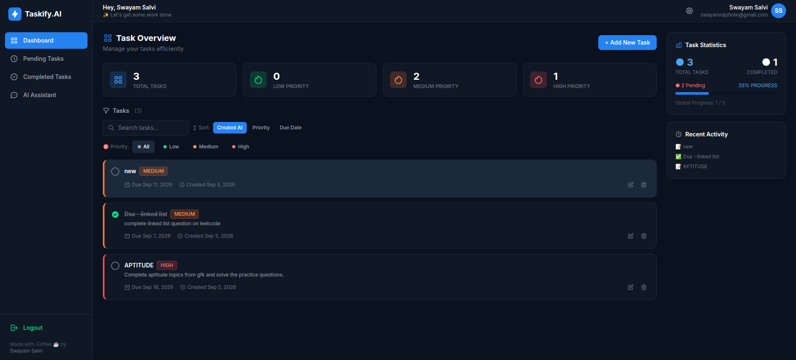
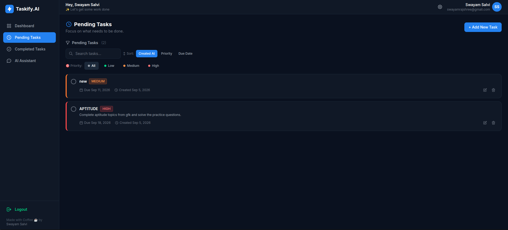
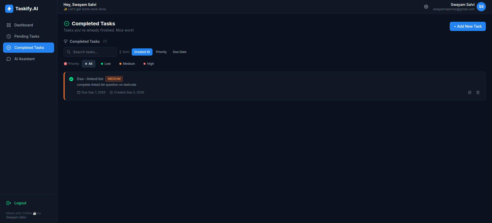
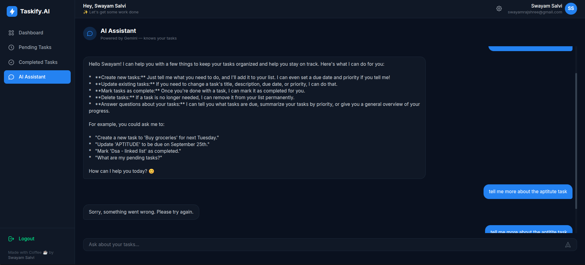
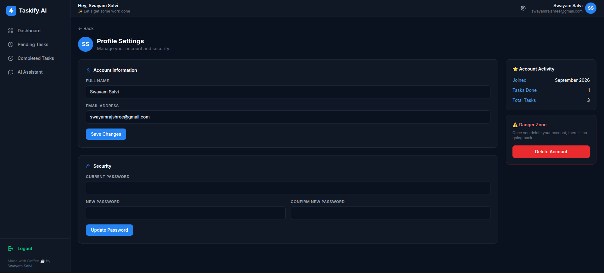

## 📱 Mobile View

<table>
  <tr>
    <td>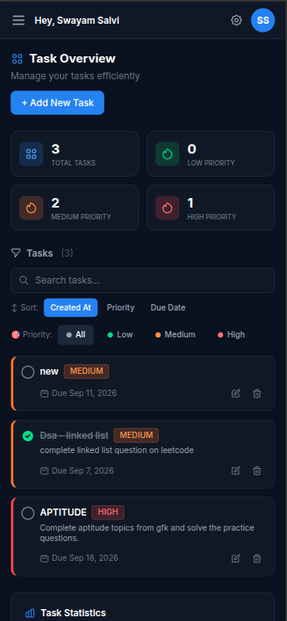</td>
    <td>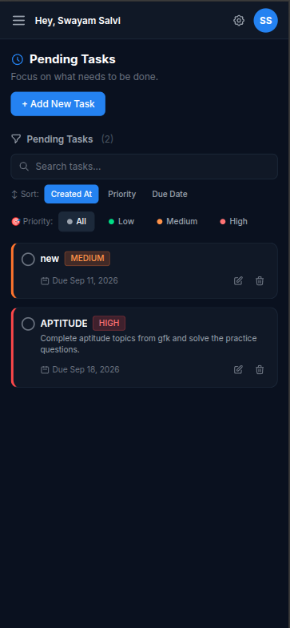</td>
    <td>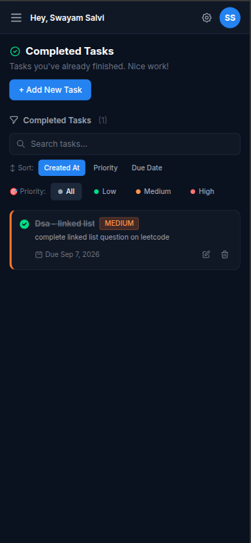</td>
    <td>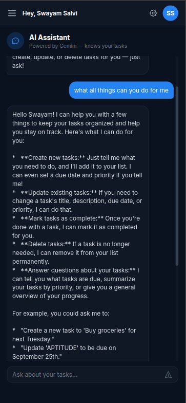</td>
    <td>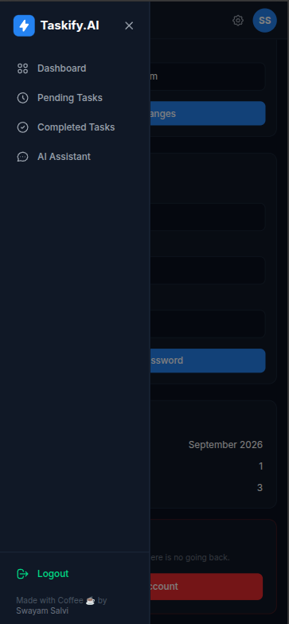</td>
    <td>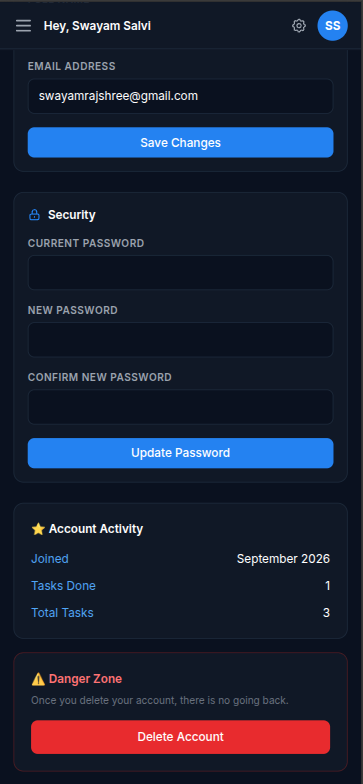</td>
  </tr>
  <tr>
    <td align="center">Dashboard</td>
    <td align="center">Pending Tasks</td>
    <td align="center">Completed Tasks</td>
    <td align="center">AI Assistant</td>
    <td align="center">Sidebar</td>
    <td align="center">Settings</td>
  </tr>
</table>

---

## ✨ Features

### 🤖 AI-Powered Task Management *(the main thing)*

The built-in Gemini AI assistant doesn't just answer questions — it **controls your task list**.

| What you can say | What it does |
|---|---|
| *"Add a task to finish the report by Friday, high priority"* | Creates the task with due date + priority |
| *"Mark the design task as done"* | Marks it completed |
| *"Delete the meeting prep task"* | Removes it |
| *"What should I focus on today?"* | Analyzes your tasks and gives a plan |
| *"I have too many tasks, help me prioritize"* | Suggests what to tackle first based on deadlines |
| *"Reschedule the API integration task to next Monday"* | Updates the due date |

The AI always has **full context of your current task list** — every title, priority, due date, and status — so its answers are actually useful.

---

### 📋 Core Features

- **Task Management** — Create, edit, delete tasks with priorities (Low / Medium / High) and due dates
- **Dashboard & Stats** — Visual overview of task progress, completion rate, and upcoming deadlines
- **Task Filters** — Switch between All, Pending, and Completed views instantly
- **Email Verification** — Secure signup with verified accounts only — no spam
- **Automated Reminders** — Email alert 24 hours before a task is due
- **Overdue Alerts** — Automatic email when a deadline passes
- **Profile & Settings** — Update name, email, and password anytime
- **Secure by Default** — JWT auth, bcrypt hashing, rate limiting, and security headers

---

## 🏗️ System Architecture

```
┌──────────────────────────────────────────────────────────────┐
│                      FRONTEND (Vercel)                       │
│                   React 19 + Vite + Tailwind                 │
│                                                              │
│   ┌────────────┐  ┌────────────┐  ┌───────────┐  ┌───────┐   │
│   │  Dashboard │  │  AI Chat   │  │ Task List │  │ Auth  │   │
│   └─────┬──────┘  └─────┬──────┘  └─────┬─────┘  └───┬───┘   │
│         └───────────────┴───────────────┴────────────┘       │
│                        Axios (JWT in headers)                │
└──────────────────────────────┬───────────────────────────────┘
                               │ HTTPS / REST API
                               ▼
┌──────────────────────────────────────────────────────────────┐
│                       BACKEND (Render)                       │
│                     Node.js + Express                        │
│                                                              │
│  ┌────────────┐    ┌────────────┐    ┌──────────────────┐    │
│  │ /api/user  │    │ /api/tasks │    │  /api/gemini     │    │
│  └────────────┘    └────────────┘    └──────────────────┘    │
│                                                              │
│  ┌──────────────────────────────────────────────────────┐    │
│  │  Middleware: JWT Auth · Rate Limit · Helmet · CORS   │    │
│  └──────────────────────────────────────────────────────┘    │
│                                                              │
│  ┌──────────────────────┐   ┌──────────────────────────┐     │
│  │  node-cron           │   │  Redis (optional cache)  │     │
│  │  Every hour:         │   │  Task stats caching      │     │
│  │  • Reminder emails   │   └──────────────────────────┘     │
│  │  • Overdue alerts    │                                    │
│  └──────────────────────┘                                    │
└──────────┬───────────────────────────┬───────────────────────┘
           │                           │
           ▼                           ▼
┌─────────────────────┐   ┌────────────────────────────────────┐
│  PostgreSQL (Neon)  │   │         External APIs              │
│                     │   │                                    │
│  users              │   │  ┌──────────────────────────────┐  │
│  ├─ id              │   │  │  Google Gemini AI            │  │
│  ├─ name            │   │  │  gemini-2.5-flash            │  │
│  ├─ email           │   │  │  Task-aware chat + actions   │  │
│  ├─ isVerified      │   │  └──────────────────────────────┘  │
│  └─ tasks[]         │   │  ┌──────────────────────────────┐  │
│                     │   │  │  Brevo Email API             │  │
│  tasks              │   │  │  Verification + Reminders    │  │
│  ├─ title           │   │  └──────────────────────────────┘  │
│  ├─ priority        │   └────────────────────────────────────┘
│  ├─ dueDate         │
│  ├─ completed       │
│  ├─ reminderSent    │
│  └─ failureSent     │
└─────────────────────┘
```

---

## 🔄 Application Flows

### 1. Registration & Email Verification

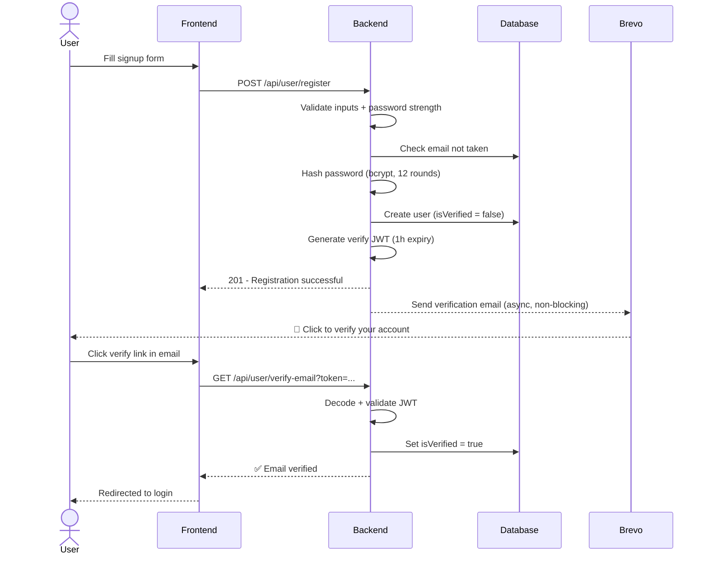

### 2. AI Task Management Flow

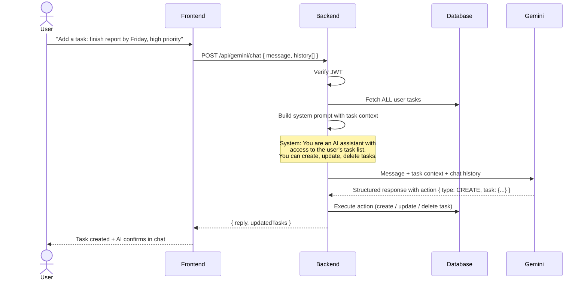

### 3. Automated Email Reminder Flow

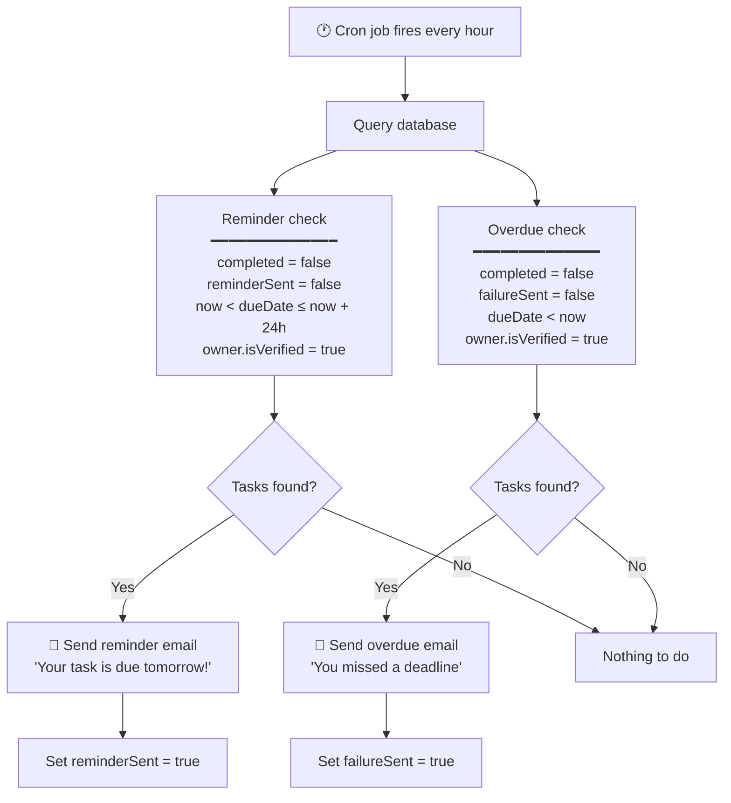

---

## 🛠️ Tech Stack

### Frontend
| Tech | Purpose |
|---|---|
| **React 19** | UI library |
| **Vite** | Build tool and dev server |
| **Tailwind CSS** | Utility-first styling |
| **React Router v6** | Client-side routing |
| **Axios** | HTTP client (JWT injected via interceptor) |

### Backend
| Tech | Purpose |
|---|---|
| **Node.js + Express** | Server runtime and REST API |
| **Prisma ORM** | Type-safe database queries + migrations |
| **PostgreSQL (Neon)** | Serverless relational database |
| **Google Gemini AI** | AI chat + task management (`gemini-2.5-flash`) |
| **Brevo API** | Transactional emails (verification + reminders) |
| **node-cron** | Hourly scheduled jobs |
| **Redis (ioredis)** | Optional stats caching |
| **JWT + Bcrypt** | Authentication + secure password storage |
| **Helmet + express-rate-limit** | Security headers + rate limiting |

---

## 💻 Local Setup

### 📋 Prerequisites

- **Node.js** v18+
- **Neon PostgreSQL** — [neon.tech](https://neon.tech) *(free tier)*
- **Google Gemini API Key** — [aistudio.google.com](https://aistudio.google.com)
- **Brevo account** — [brevo.com](https://brevo.com) *(free: 300 emails/day)*

### Clone & Install

```bash
git clone https://github.com/SwayamSalvi2005/taskify_ai.git
cd taskify_ai
```

```bash
# Install backend deps
cd backend && npm install
```

```bash
# Install frontend deps
cd ../frontend && npm install
```

---

## ⚙️ Environment Variables

### Backend — `backend/.env`

```bash
# Server
PORT=5000
NODE_ENV=development
CLIENT_URL=http://localhost:5173

# Database
DATABASE_URL=your_neon_connection_string

# JWT
JWT_SECRET=your_secret_key
JWT_EXPIRES_IN=24h

# AI
GEMINI_API_KEY=your_gemini_api_key
GEMINI_MODEL=gemini-2.5-flash

# Email (Brevo)
BREVO_API_KEY=your_brevo_api_key

# Cache (optional)
# REDIS_URL=your_upstash_redis_url
```

### Frontend — `frontend/.env`

```bash
VITE_API_URL=http://localhost:5000/api
```

---

## ▶️ Run the Project

```bash
# Terminal 1 — start backend
cd backend
npx prisma generate
node server.js
```

```bash
# Terminal 2 — start frontend
cd frontend
npm run dev
```

App runs at **http://localhost:5173**

---

## 📡 API Reference

### Auth — `/api/user`

| Method | Endpoint | Auth | Description |
|--------|----------|:----:|-------------|
| `POST` | `/register` | — | Register + trigger verification email |
| `POST` | `/login` | — | Login, returns JWT |
| `GET` | `/verify-email?token=` | — | Verify email from link |
| `GET` | `/me` | ✅ | Get authenticated user |
| `PUT` | `/profile` | ✅ | Update name / email |
| `PUT` | `/password` | ✅ | Change password |
| `DELETE` | `/delete` | ✅ | Delete account + all tasks |

### Tasks — `/api/tasks`

| Method  | Endpoint | Auth | Description |
|-------- |----------|:----:|-------------|
| `GET`   | `/` | ✅ | Get all user tasks |
| `POST`  | `/` | ✅ | Create task |
| `PUT`   | `/:id` | ✅ | Update task |
| `DELETE`| `/:id` | ✅ | Delete task |
| `GET`   | `/stats/summary` | ✅ | Task statistics |

### AI — `/api/gemini`

| Method | Endpoint | Auth | Description |
|--------|----------|:----:|-------------|
| `POST` | `/chat` | ✅ | AI chat with full task context + action capability |

---

## 📁 Project Structure

```
taskify_ai/
│
├── backend/
│   ├── config/
│   │   ├── database.js          # Prisma singleton
│   │   └── redis.js             # Redis connection + cache helpers
│   │
│   ├── controllers/
│   │   ├── userController.js    # Auth, profile, password, account delete
│   │   ├── taskController.js    # Task CRUD + stats
│   │   └── geminiController.js  # AI chat handler
│   │
│   ├── jobs/
│   │   └── cronJobs.js          # Hourly reminder + overdue email cron
│   │
│   ├── middlewares/
│   │   ├── authMiddleware.js    # JWT verification
│   │   └── errorHandler.js      # Global error handler
│   │
│   ├── prisma/
│   │   └── schema.prisma        # User + Task models
│   │
│   ├── routes/
│   │   ├── userRoutes.js
│   │   ├── taskRoutes.js
│   │   └── geminiRoutes.js
│   │
│   ├── services/
│   │   ├── userService.js       # Registration, login, verify, update
│   │   ├── taskService.js       # Task business logic
│   │   ├── geminiService.js     # Gemini API + task context builder
│   │   └── emailService.js      # Brevo email templates
│   │
│   └── server.js                # Express entry point
│
└── frontend/
    ├── src/
    │   ├── api/
    │   │   ├── axios.js         # Axios instance (base URL + JWT header)
    │   │   ├── userApi.js
    │   │   ├── taskApi.js
    │   │   └── geminiApi.js
    │   │
    │   ├── components/
    │   │   ├── layout/          # Sidebar, Layout wrapper
    │   │   ├── tasks/           # TaskCard, TaskForm, TaskFormModal
    │   │   └── settings/        # ProfileForm, PasswordForm
    │   │
    │   ├── context/
    │   │   ├── AuthContext.jsx  # Auth state + login/logout
    │   │   └── TaskContext.jsx  # Task state + CRUD actions
    │   │
    │   └── pages/
    │       ├── Dashboard.jsx
    │       ├── AIAssistant.jsx
    │       ├── PendingTasks.jsx
    │       ├── CompletedTasks.jsx
    │       ├── Settings.jsx
    │       ├── Login.jsx
    │       ├── Register.jsx
    │       └── VerifyEmail.jsx
    │
    ├── vercel.json              # SPA routing for Vercel
    └── index.html
```

---

## 🚀 Deployment

| Layer | Platform | Config |
|-------|----------|--------|
| **Frontend** | [Vercel](https://vercel.com) | Root dir: `frontend` · Auto-deploys on push |
| **Backend** | [Render](https://render.com) | Root dir: `backend` · Node web service |
| **Database** | [Neon](https://neon.tech) | Serverless PostgreSQL · Free tier |

**Build command (Render):** `npm install && npx prisma generate`  
**Start command (Render):** `node server.js`

> Set all environment variables in the Render dashboard. Make sure `CLIENT_URL` points to your Vercel URL and `NODE_ENV=production`.

---

## 📝 Contributing

Contributions are welcome! Open an issue or submit a pull request.

## 📧 Support

For bugs or questions, open an issue on the repository.

---

<div align="center">

**Built with Coffee ☕ by Swayam Salvi**

</div>
